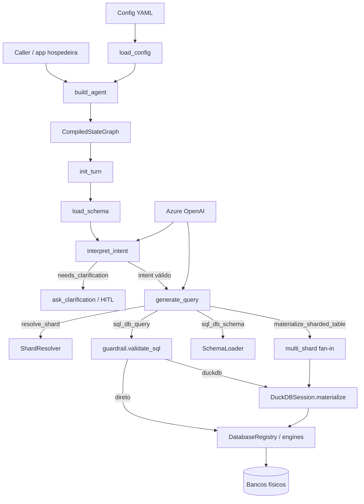
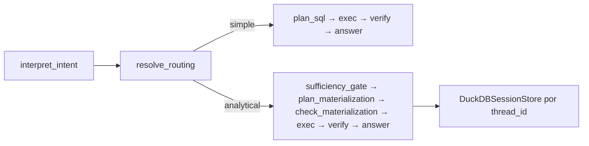

# Arquitetura

## Visão geral

`txt2sql` é uma biblioteca que monta um grafo LangGraph para transformar perguntas em SQL seguro. A configuração YAML descreve bancos, tabelas lógicas, sharding e gatilhos DuckDB. Em runtime, o grafo carrega schema, resolve shards, valida SQL e executa no banco de origem ou numa sessão DuckDB efêmera do turno.

## Diagrama

### Grafo dual-path (padrão)

`build_agent(...)` usa o grafo dual-path por padrão. Após `interpret_intent` o fluxo passa por `resolve_routing` (determinístico, sem tools de shard no LLM) e bifurca. Passe `dual_path=False` para o loop ReAct legado.

Sharding e `force_analytical` entram via routing/policy gate — não via `resolve_shard` no loop ReAct. O diagrama acima descreve o path dual-path (padrão); o path legado ReAct permanece com `dual_path=False`.

## Componentes

**`build_agent` (`agent.py`)** — monta o grafo, injeta registry/schema/shard/DuckDB nos nós e compila com checkpointer opcional do caller.

**`load_config` / `AgentConfig` (`config.py`)** — parse e validação do YAML; índices por `database_id` e `table_id`.

**`DatabaseRegistry` (`db/registry.py`)** — cria engines SQLAlchemy (com listener read-only quando aplicável) e executa queries roteadas; execução OLTP em `sql_db_query` respeita `query_timeout` (deadline no cliente).

**`SchemaLoader` (`db/schema.py`)** — schema declarativo ou discovery + amostras para o prompt/tool.

**`ShardResolver` (`db/shard.py`)** — tool `resolve_shard`; importa o callable dotted e cacheia resultados no estado do turno.

**`materialize_sharded_values` (`db/multi_shard.py`)** — fan-in: resolve N discriminadores, agrupa por físico, materializa no DuckDB com `WHERE disc IN (...)`.

**`DuckDBSession` (`db/duckdb_layer.py`)** — materializa lotes da origem em DuckDB in-memory (create / append / replace) e reexecuta a query analítica.

**`validate_sql` (`guardrail.py`)** — AST sqlglot fail-closed; denylist textual complementar.

**`Txt2SqlPromptBuilder` / `build_llm`** — system prompt (SQL) e prompt de interpretação de intenção; cliente Azure OpenAI.

**`intent` (`intent.py`)** — `IntentPlan` (structured output) + `validate_intent` fail-closed contra índice de colunas do `SchemaLoader`.

## Fluxo de dados (pergunta → resposta)

1. Caller invoca o grafo com `HumanMessage` e `thread_id`.
2. `init_turn` cria sessão DuckDB efêmera e zera contadores do turno.
3. `load_schema` alimenta o contexto; `interpret_intent` produz um `IntentPlan` validado (ou pede clarificação via HITL).
4. Com plan válido, o LLM em `generate_query` gera tool calls a partir do intent.
5. Tabelas shardadas: single → `resolve_shard`; multi (2+) → `materialize_sharded_table` antes do SELECT analítico.
6. `sql_db_query` → `check_query` (guardrail) → rota direta ou DuckDB.
7. No caminho DuckDB: materializa da origem (ou reusa fan-in já feito) → query analítica.
8. Resultado truncado (`top_k` / `max_string_length`) volta ao LLM até a resposta final; sessão DuckDB é descartada.

## Dependências externas

| Serviço | Papel |
|---------|--------|
| Azure OpenAI | LLM do agente |
| Bancos SQL (Postgres, MSSQL, SQLite, …) | Fontes via SQLAlchemy |
| Langfuse (opcional) | Tracing |
| DuckDB | Analítico in-process |

## Decisões-chave

Detalhes em [docs/adr/](adr/). Resumo:

- Biblioteca standalone (sem FastAPI embutido) — ver ADR-0001.
- Sharding determinístico sem fan-out — ADR-0002.
- DuckDB intermediário por turno — ADR-0003.
- Guardrail read-only via sqlglot — ADR-0004.
- Schema declarativo com discovery opcional — ADR-0005.
