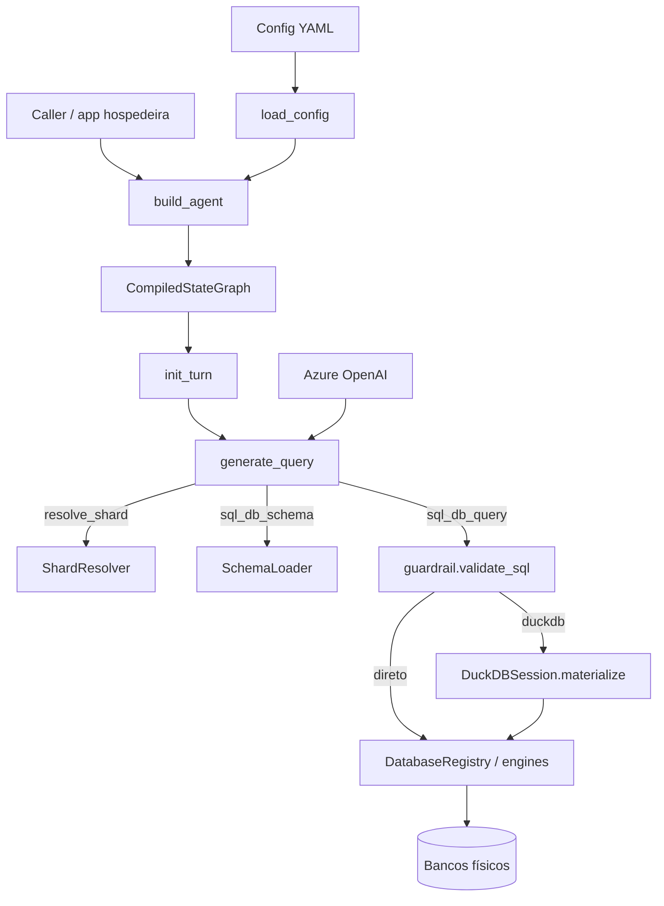

# Arquitetura

## Visão geral

`txt2sql` é uma biblioteca que monta um grafo LangGraph para transformar perguntas em SQL seguro. A configuração YAML descreve bancos, tabelas lógicas, sharding e gatilhos DuckDB. Em runtime, o grafo carrega schema, resolve shards, valida SQL e executa no banco de origem ou numa sessão DuckDB efêmera do turno.

## Diagrama

## Componentes

**`build_agent` (`agent.py`)** — monta o grafo, injeta registry/schema/shard/DuckDB nos nós e compila com checkpointer opcional do caller.

**`load_config` / `AgentConfig` (`config.py`)** — parse e validação do YAML; índices por `database_id` e `table_id`.

**`DatabaseRegistry` (`db/registry.py`)** — cria engines SQLAlchemy (com listener read-only quando aplicável) e executa queries roteadas.

**`SchemaLoader` (`db/schema.py`)** — schema declarativo ou discovery + amostras para o prompt/tool.

**`ShardResolver` (`db/shard.py`)** — tool `resolve_shard`; importa o callable dotted e cacheia resultados no estado do turno.

**`DuckDBSession` (`db/duckdb_layer.py`)** — materializa lotes da origem em DuckDB in-memory e reexecuta a query analítica.

**`validate_sql` (`guardrail.py`)** — AST sqlglot fail-closed; denylist textual complementar.

**`Txt2SqlPromptBuilder` / `build_llm`** — system prompt e cliente Azure OpenAI.

## Fluxo de dados (pergunta → resposta)

1. Caller invoca o grafo com `HumanMessage` e `thread_id`.
2. `init_turn` cria sessão DuckDB efêmera e zera contadores do turno.
3. Se necessário, `load_schema` alimenta o contexto; o LLM gera tool calls.
4. Tabelas shardadas passam por `resolve_shard` antes de qualquer SELECT.
5. `sql_db_query` → `check_query` (guardrail) → rota direta ou DuckDB.
6. No caminho DuckDB: `SELECT *` limitado da origem em lotes → tabela lógica no DuckDB → query analítica.
7. Resultado truncado (`top_k` / `max_string_length`) volta ao LLM até a resposta final; sessão DuckDB é descartada.

## Dependências externas

| Serviço | Papel |
|---------|--------|
| Azure OpenAI | LLM do agente |
| Bancos SQL (Postgres, MSSQL, SQLite, …) | Fontes via SQLAlchemy |
| Langfuse (opcional) | Tracing |
| DuckDB | Analítico in-process |

## Decisões-chave

Detalhes em [docs/adr/](adr/). Resumo:

- Biblioteca standalone (sem FastAPI embutido) — ver ADR-0001.
- Sharding determinístico sem fan-out — ADR-0002.
- DuckDB intermediário por turno — ADR-0003.
- Guardrail read-only via sqlglot — ADR-0004.
- Schema declarativo com discovery opcional — ADR-0005.
