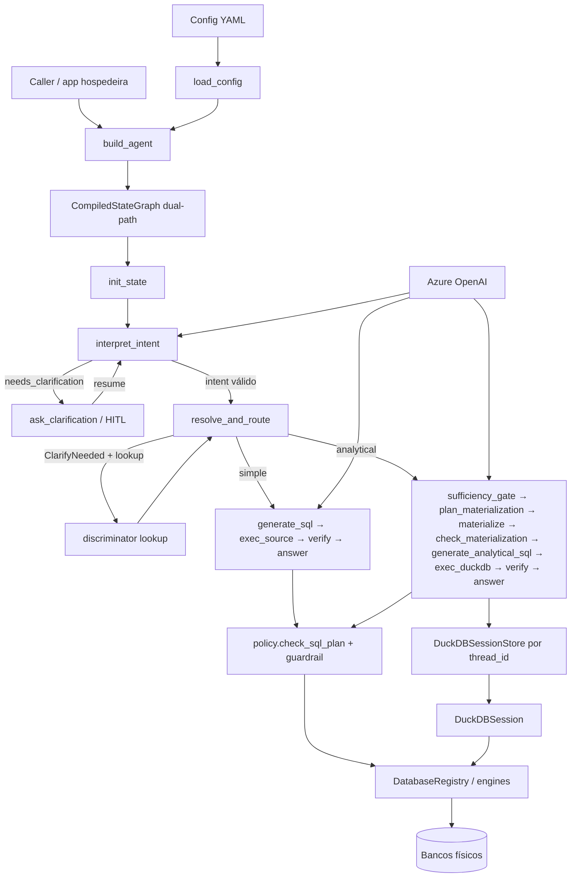

# Arquitetura

## Visão geral

`txt2sql` é uma biblioteca que monta um grafo LangGraph para transformar perguntas em SQL seguro. A configuração YAML descreve bancos, tabelas lógicas, sharding e gatilhos DuckDB. Em runtime, o grafo carrega schema, interpreta intenção, resolve shards de forma determinística, valida SQL (Policy Gate + guardrail) e executa no banco de origem ou numa sessão DuckDB associada ao `thread_id`.

## Diagrama

### Dual-path vs legado

`build_agent(...)` compila **apenas** o grafo dual-path (`txt2sql.graph`). Após `interpret_intent`, `resolve_and_route` combina `resolve_routing` (shard) + `route_execution` (simple \| analytical) — **sem tools de shard no LLM**.

Sharding e `force_analytical` entram via routing/policy. Detalhes: [ADR-0006](adr/0006-grafo-dual-path-padrao.md).

## Componentes

**`build_agent` (`agent.py`)** — entrypoint fino que delega a `graph.build_graph`.

**`build_graph` (`graph.py`)** — grafo dual-path: intent → route → simple/analytical, budgets, HITL, verify/answer.

**`load_config` / `AgentConfig` (`config.py`)** — parse e validação do YAML; índices por `database_id` e `table_id`.

**`intent` (`intent.py`)** — `IntentPlan` (structured output) + `validate_intent` fail-closed contra índice de colunas do `SchemaLoader`.

**`artifacts` (`artifacts.py`)** — planos tipados (`SQLPlan`, `MaterializationPlan`, …), `Budget`, `DuckDBCatalog`.

**`shard_routing` / `path_routing`** — `resolve_routing` (discriminador → bindings) e `route_execution` (simple vs analytical).

**`policy` (`policy.py`)** — Policy Gate composto (read-only, shard resolvido, volume, `force_analytical`) antes da execução.

**`middleware` (`middleware.py`)** — compactação de resultados / factories de `ExecutionResult`.

**`DatabaseRegistry` (`db/registry.py`)** — engines SQLAlchemy e execução roteada; `query_timeout` no cliente OLTP.

**`SchemaLoader` (`db/schema.py`)** — schema declarativo ou discovery + amostras.

**`fan_in` (`db/fan_in.py`)** — materializa um ou mais bindings shardados no nome lógico DuckDB.

**`DuckDBSession` / `DuckDBSessionStore`** — materialização em lotes; store file-backed por `thread_id`.

**`validate_sql` (`guardrail.py`)** — AST sqlglot fail-closed; denylist textual complementar.

**`Txt2SqlPromptBuilder` / `build_llm`** — system prompt (SQL) e prompt de intenção; cliente Azure OpenAI.

## Fluxo de dados (pergunta → resposta)

1. Caller invoca o grafo com `HumanMessage` e `thread_id` (checkpointer recomendado para HITL).
2. `init_state` prepara budget e contexto do turno (reusa sessão DuckDB do `thread_id` se existir).
3. `interpret_intent` produz um `IntentPlan` validado — ou roteia para `ask_clarification` (interrupt / mensagem).
4. `resolve_and_route` resolve shards e escolhe *simple* ou *analytical* (`force_analytical`, multi-shard, agregação em tabela DuckDB). Se faltar discriminador mas existir tabela lookup relacionada (`RelationshipConfig`), faz lookup-then-route (DISTINCT → injeta filters → re-resolve) sem HITL.
5. **Simple:** LLM gera `SQLPlan` (postgres) → Policy Gate → `exec_source` → `verify` → `answer` (ou refine).
6. **Analytical:** sufficiency gate (reuse/refresh) → plano de materialização → extract na origem → SQL DuckDB → `verify` → `answer`.
7. Resultado compactado (`Budget.sample_rows` / truncamento) volta ao caminho de verificação até a resposta final.

## Dependências externas

| Serviço | Papel |
|---------|--------|
| Azure OpenAI | LLM do agente |
| Bancos SQL (Postgres, MSSQL, SQLite, …) | Fontes via SQLAlchemy |
| Langfuse (opcional) | Tracing |
| DuckDB | Analítico in-process |

## Decisões-chave

Detalhes em [docs/adr/](adr/). Resumo:

- Biblioteca standalone (sem FastAPI embutido) — ver ADR-0001.
- Sharding determinístico sem fan-out — ADR-0002.
- DuckDB intermediário (turno / `thread_id`) — ADR-0003.
- Guardrail read-only via sqlglot — ADR-0004.
- Schema declarativo com discovery opcional — ADR-0005.
- Grafo dual-path como padrão + Policy Gate — ADR-0006.
