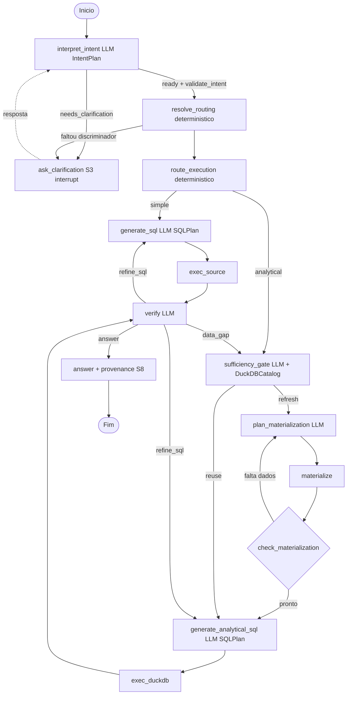

### Especificação Técnica — Agente Text2SQL (LangGraph + DuckDB)

> Versão revisada após grilling (2026-07-28). Substitui o rascunho anterior:
> IntentPlan grounded evoluí­do; path determinístico; sharding via `resolve_routing`;
> `force_analytical` no YAML; catálogo DuckDB reutilizável; refine em dois níveis;
> timeout origem + DuckDB (client deadline).

---

#### 1. Visão Geral

Agente text-to-SQL com dois caminhos de execução:

- **simples** — `SQLPlan` → execução read-only no banco de origem;
- **analítico** — extract na origem → DuckDB → SQL analítico local.

Nós cognitivos (LLM) produzem artefatos tipados; nós determinísticos só executam.
Segurança e limites vêm de middleware transversal (Policy Gate, Timeout, Result Compactor, Budget Tracker).

**Não-objetivos desta rearquitetura:** fan-out cego entre shards; análise pesada em tabelas OLTP-hot na origem; substituir o `IntentPlan` grounded por plano de strings livres.

---

#### 2. Topologia do grafo



Middleware envolve `exec_source`, `materialize` e `exec_duckdb`.

---

#### 3. Schema do Estado (LangGraph)

```python
from pydantic import BaseModel, Field
from typing import Literal, Optional
from datetime import datetime

# IntentPlan grounded: ver txt2sql/intent.py (evoluí­do, não substituí­do).
# LogicalPlan = projeção de IntentPlan para provenance (S4/S8), não output LLM.

class LogicalPlan(BaseModel):  # view / provenance
    tables: list[str]
    joins: list[str] = []
    filters: list[str] = []
    aggregations: list[str] = []
    limit: int | None = None
    assumptions: list[str] = []

    @classmethod
    def from_intent(cls, intent_plan: "IntentPlan") -> "LogicalPlan": ...

class ShardBinding(BaseModel):
    table_id: str
    discriminator_value: str
    database_id: str
    physical_table: str

class ShardRouting(BaseModel):
    mode: Literal["none", "single", "multi"]
    bindings: list[ShardBinding] = []
    logical_table: Optional[str] = None  # fan-in multi no DuckDB

class SQLPlan(BaseModel):
    sql: str
    dialect: Literal["postgres", "duckdb"]
    params: dict = {}
    expected_shape: Literal["scalar", "row", "table"]
    # timeout efetivo vem de AgentConfig.query_timeout (+ override por DB)

class MaterializationStep(BaseModel):
    source_query: str                 # extract filtrado na origem (sem agg pesada se force_analytical)
    target_table: str
    mode: Literal["create", "append", "replace"]
    estimated_rows: Optional[int] = None
    shard_binding: Optional[ShardBinding] = None
    shard_bindings: list[ShardBinding] = []  # multi fan-in

class MaterializationPlan(BaseModel):
    steps: list[MaterializationStep]
    rationale: str

class ExecutionResult(BaseModel):
    status: Literal["ok", "error", "rejected", "timeout"]
    row_count: int = 0
    schema_: list[dict] = Field(default=[], alias="schema")
    sample: list[dict] = []
    stats: dict = {}
    truncated: bool = False
    full_result_ref: Optional[str] = None
    error: Optional[str] = None
    warnings: list[str] = []

class DuckDBTableInfo(BaseModel):
    name: str
    schema_: list[dict] = Field(alias="schema")
    row_count: int
    source_queries: list[str]
    covered_filters: list[str] = []   # para o Gate julgar reuse
    shard_bindings: list[ShardBinding] = []
    materialized_at: datetime

class DuckDBCatalog(BaseModel):
    tables: list[DuckDBTableInfo] = []

class Budget(BaseModel):
    refine_count: int = 0
    max_refine: int = 3
    mat_loop_count: int = 0
    max_mat_loops: int = 3
    gate_visits: int = 0
    max_gate_visits: int = 2
    total_rows_materialized: int = 0
    max_rows_materialized: int = 2_000_000
    max_rows_per_extract: int = 500_000
    sample_rows: int = 20

    def exhausted(self, counter: str) -> bool: ...

class VerifyDecision(BaseModel):
    action: Literal["answer", "refine_sql", "data_gap"]
    reason: str = ""

class AgentState(BaseModel):
    question: str
    messages: list  # histórico / checkpointer
    intent_plan: Optional[dict] = None          # IntentPlan serializado
    execution_path: Optional[Literal["simple", "analytical"]] = None
    shard_routing: Optional[ShardRouting] = None
    assumptions: list[str] = []

    sql_plan: Optional[SQLPlan] = None
    materialization_plan: Optional[MaterializationPlan] = None
    last_result: Optional[ExecutionResult] = None
    executed_sql_history: list[str] = []
    verify_decision: Optional[VerifyDecision] = None

    duckdb_catalog: DuckDBCatalog = DuckDBCatalog()
    budget: Budget = Budget()
    partial: bool = False
    final_answer: Optional[str] = None
```

Sessão DuckDB física: **por `thread_id`** (preferência file-backed). Catálogo no state (checkpointer). Revisar ADR-0003.

---

#### 4. Nós do Grafo

| Nó | Tipo | Entrada | Saída | Regras |
|---|---|---|---|---|
| `interpret_intent` | LLM | `question`, schema, histórico | `IntentPlan` | Structured output; `validate_intent` fail-closed; ambiguidade → clarify |
| `ask_clarification` | interrupt | `clarification` | resposta → `interpret_intent` | S3; checkpointer obrigatório para resume; sem checkpointer → mensagem + END |
| `resolve_routing` | determinístico | `IntentPlan` + config sharding | `ShardRouting` | Sem discriminador em tabela shardada → clarify; chama resolver dotted; multi → força analytical; **sem tool LLM** |
| `route_execution` | determinístico | intent + routing + YAML | `execution_path` | Ver §5 |
| `generate_sql` | LLM | IntentPlan, schema, erro anterior | `SQLPlan` (postgres) | Preserva IntentPlan em retries (S4); nomes físicos se `mode=single` |
| `exec_source` | determinístico | `SQLPlan` | `ExecutionResult` | Middleware; Registry read-only |
| `sufficiency_gate` | LLM | IntentPlan, `DuckDBCatalog` | reuse \| refresh | Incrementa `gate_visits`; fail-closed se catálogo diz reuse mas sessão sumiu → refresh |
| `plan_materialization` | LLM | IntentPlan, schema, routing, catálogo | `MaterializationPlan` | Extract com pushdown; sem agg pesada se `force_analytical` |
| `materialize` | determinístico | `MaterializationPlan` | atualiza catálogo + `ExecutionResult` | Lotes (`BATCH_SIZE`); multi reusa fan-in; budget de rows |
| `check_materialization` | LLM/regras | catálogo, plano | pronto \| falta | Incrementa `mat_loop_count` |
| `generate_analytical_sql` | LLM | IntentPlan, catálogo | `SQLPlan` (duckdb) | Só tabelas do catálogo / nomes lógicos |
| `exec_duckdb` | determinístico | `SQLPlan` | `ExecutionResult` | Middleware; resultado grande → ref |
| `verify` | LLM | `last_result`, IntentPlan | `VerifyDecision` | Ver §6 |
| `answer` | LLM | estado | `final_answer` | S8: SQL, assumptions, `partial`, LogicalPlan projetado |

---

#### 5. Roteamento de path (determinístico)

```
se alguma table_id do IntentPlan tem duckdb.force_analytical → analytical
se shard_routing.mode == multi → analytical
se metrics com agg != none (ou group_by) em tabela duckdb.enabled → analytical
senão → simple
```

**YAML** (`tables[].duckdb`):

```yaml
duckdb:
  enabled: true
  force_analytical: true   # obriga extract → DuckDB → análise
  fetch_limit: 100000
  # trigger: aggregation|order|join — só se force_analytical for false
  # trigger: always — alias de force_analytical: true
```

Com `force_analytical`: Policy Gate rejeita agregação/`ORDER BY` analítico/`JOIN` pesado no `source_query` da origem.

**Sharding (ADR-0002):**

| mode | Comportamento |
|---|---|
| `none` | path conforme regras acima |
| `single` | binding físico; se analytical → um extract no shard; se simple → `exec_source` no físico |
| `multi` | sempre analytical; fan-in → nome lógico no DuckDB |

---

#### 6. Verify — refine em dois níveis

| `VerifyDecision.action` | Quando | Rota | Contador |
|---|---|---|---|
| `answer` | resultado suficiente | `answer` | — |
| `refine_sql` | SQL/shape corrigível no mesmo contexto/catálogo | `generate_sql` ou `generate_analytical_sql` | `refine_count` |
| `data_gap` | faltam dados no offload | `sufficiency_gate` | `gate_visits` |
| (budget) | qualquer contador esgotado | `answer` com `partial=True` | — |

---

#### 7. Middleware (hooks sobre nós determinísticos)

```
pre_hook:  Policy Gate (S1) → Budget check → timeout (S2)
execute:   nó determinístico
post_hook: Result Compactor → Asserts (S6) → Budget update
```

**Policy Gate (S1)** — rejeita sem executar:

- Apenas `SELECT` (AST sqlglot); deny DML/DDL/`COPY`/`ATTACH`.
- Allow-list de tabelas (lógicas + físicas resolvidas); deny-list de colunas sensíveis.
- Nome lógico shardado sem binding → `rejected` (absorve `routing_rejection_reason`).
- `LIMIT` injetado se ausente (`max_rows_per_extract` / `fetch_limit`).
- Estimativa de volume antes de materializar; excesso → `rejected` com orientação de pushdown.
- Análise pesada na origem quando `force_analytical` → `rejected`.

**Timeout (S2):**

- Config: `agent.query_timeout` (+ override por DB); **não** renomear para `query_timeout_seconds`.
- Mecanismo: client deadline (thread+join), como hoje — não `SET statement_timeout` no driver.
- Escopo: origem (`exec_source`, extract em `materialize`) **e** `exec_duckdb`.
- Estouro → `ExecutionResult.status="timeout"`; fluxo continua (refine / answer parcial).

**Result Compactor + Asserts (S6):** máx. `sample_rows` no contexto; resto → tabela DuckDB + `full_result_ref`; `EMPTY_RESULT` / shape → `warnings`.

**Budget Tracker:** estouro → `answer` + `partial=True`; `recursion_limit` LangGraph como backstop.

---

#### 8. Fora do Grafo (CI)

- **S5:** Policy Gate offline (DML, allow-list, LIMIT, unresolved shard, `force_analytical` + agg na origem, volume).
- **S7:** harness 10–15 perguntas reais; sucesso / custo / rejeição / latência — sem exact-match de SQL.

---

### Histórias de Usuário

**Épico 1 — Fluxo simples + intent**
- **US-01**: Resposta com provenance (SQL, assunções, `partial`) — S8.
- **US-02**: Refine automático até `max_refine`; depois partial, nunca erro seco.
- **US-03**: Clarify via `interrupt` em ambiguidade material; premissas não-materiais → assumptions — S3. *(já parcialmente shipped)*

**Épico 2 — Fluxo analítico (DuckDB)**
- **US-04**: Análise sem sobrecarregar OLTP; extract → DuckDB.
- **US-05**: Follow-up reusa catálogo quando o Gate julga suficiente.
- **US-06**: Loop de materialização até `max_mat_loops`; estouro → partial.
- **US-15**: Tabela com `force_analytical: true` nunca executa análise pesada na origem.
- **US-16**: Sharding via `resolve_routing` — single binding ou multi fan-in; sem discriminador → clarify; fan-out cego proibido.

**Épico 3 — Segurança e limites**
- **US-07**: Nenhuma escrita na origem (Gate AST + conta read-only) — S5.
- **US-08**: Limite de volume por extract e cumulativo.
- **US-09**: Timeout origem + DuckDB → `status=timeout` — S2.
- **US-10**: Resultados grandes compactados (`sample_rows` + ref).
- **US-11**: Budgets + `recursion_limit` → partial.

**Épico 4 — Qualidade**
- **US-12**: Suíte S5 no CI.
- **US-13**: Harness S7.
- **US-14**: Warnings S6 na resposta final.

---

### Ordem de implementação

1. **Fase 0 — Fundação:** artefatos tipados (`SQLPlan`, `ExecutionResult`, `Budget`, `ShardRouting`); `force_analytical` no config; evoluir state sem big-bang do grafo.
2. **Fase 1 — Segurança + provenance:** Policy Gate estendido (S1) + timeout tipado origem/DuckDB (S9) + `answer`/S8 (US-01/07/08/09/12); clarify já existe (US-03).
3. **Fase 2 — Dual path + sharding:** `resolve_routing` + `route_execution` + path simple/analytical + materialização planejada + Gate reuse (US-04/05/06/15/16/02/11).
4. **Fase 3 — Compactor + asserts:** US-10/14.
5. **Fase 4 — Harness:** US-13 (S7) e revisão ADR-0003.

---

### ADRs impactados

| ADR | Ação |
|---|---|
| 0002 Sharding determinístico | Mantém; muda *como* (nó `resolve_routing` no lugar de tools LLM) |
| 0003 DuckDB por turno | **Revisar** — sessão/catálogo por `thread_id` + Gate reuse |
| 0004 Guardrail sqlglot | Evolui para Policy Gate (LIMIT, volume, force_analytical, routing) |
